# Sơ đồ Mermaid cho báo cáo đợt 2

> File này chỉ chứa các **sơ đồ** dùng để cập nhật vào file Word báo cáo (`LamDuyQuy_C10_BCDK2.docx`).
> Nội dung chữ (phân tích, thiết kế, tiến độ, kế hoạch...) nằm trong file Word — đã được cập nhật
> trực tiếp vào các mục tương ứng của đợt 1 theo code hiện tại, không tách riêng thành chương "đợt 2"
> nói lại từ đầu.
>
> Cách lấy ảnh: copy đoạn mã trong khối ` ```mermaid ` của từng sơ đồ, dán vào
> **https://mermaid.live**, bấm **Actions → Download PNG**, rồi dán vào đúng vị trí có ghi
> `[CHỖ DÁN ẢNH — Sơ đồ N ...]` trong file Word. Sau khi commit file này lên GitHub, GitHub cũng tự
> render trực tiếp khi xem trên web (dùng để xem trước, kiểm tra sơ đồ có đúng không).

---

## Sơ đồ 1 — Use Case: Khách (chưa đăng nhập)

Không đổi so với đợt 1 — nhóm chức năng này chưa có thay đổi.

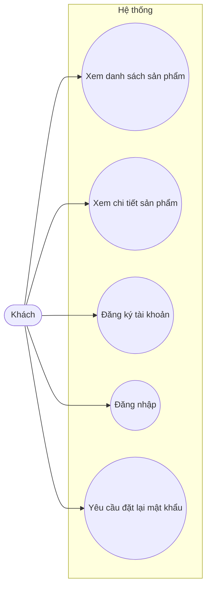

## Sơ đồ 2 — Use Case: Khách hàng đã đăng nhập (cập nhật theo code hiện tại)

Bổ sung so với đợt 1: phân tích khuôn mặt, lịch sử phân tích, nhận gợi ý, thử kính ảo, giỏ hàng,
đặt hàng và theo dõi đơn hàng.

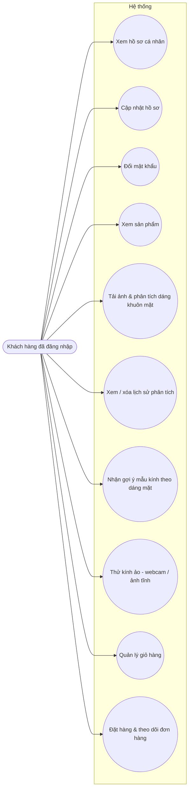

## Sơ đồ 3 — Use Case: Quản trị viên (cập nhật theo code hiện tại)

Bổ sung so với đợt 1: quản lý vai trò & phân quyền (RBAC), quản lý người dùng, cập nhật trạng thái
đơn hàng.

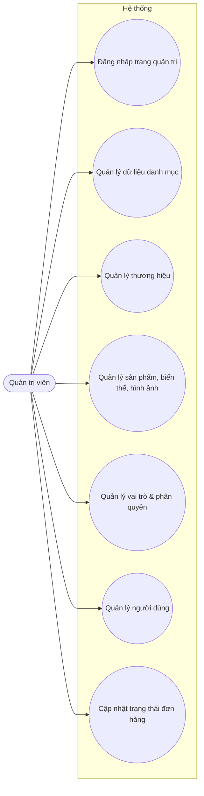

## Sơ đồ 4 — Kiến trúc Microservices tổng thể (cập nhật, trạng thái hiện tại)

Thay cho sơ đồ đợt 1 (khi đó chỉ có API Gateway/User/Product Service là thật) — sơ đồ này phản ánh
đúng trạng thái hiện tại: Order, Face Processing, Recommendation Service đã hoạt động thật; Payment
Service vẫn chưa triển khai.

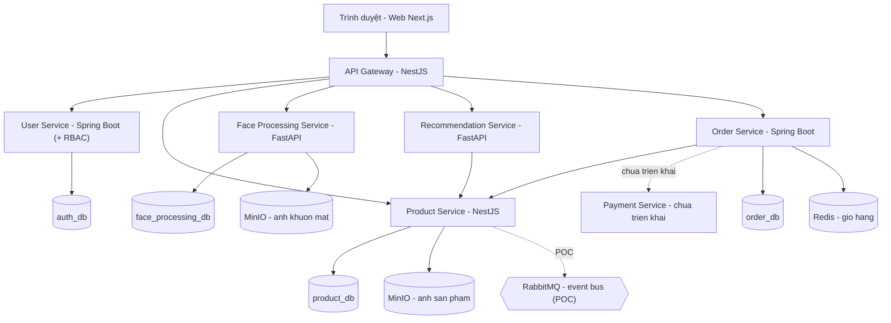

## Sơ đồ 5 — API Gateway (cập nhật)

Bổ sung so với đợt 1: Gateway hiện proxy thêm các nhóm route face-analysis, recommendations, cart,
orders, RBAC — bảo vệ bằng guard theo quyền cụ thể (permission-based), không chỉ theo vai trò cố
định như trước.

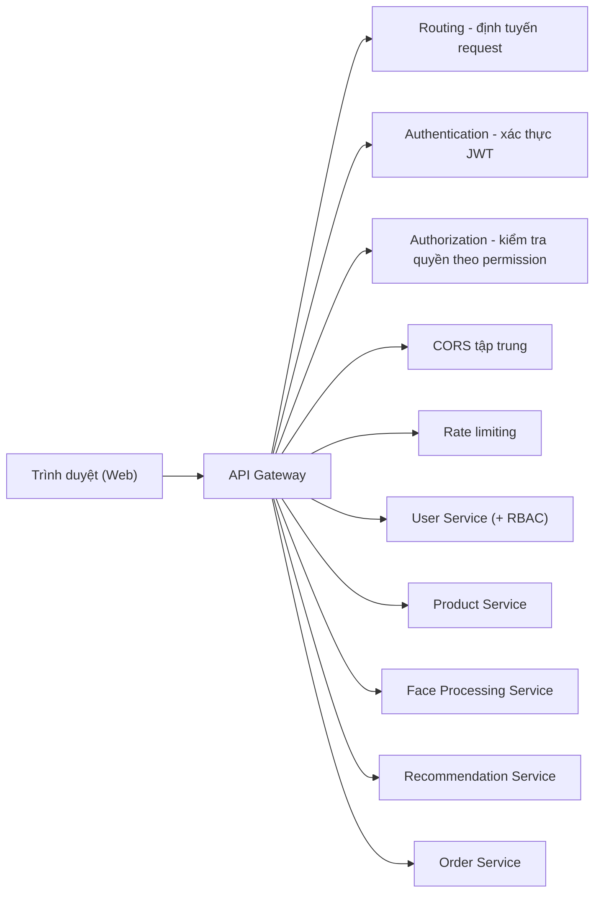

## Sơ đồ 6 — ERD User Service (cập nhật, có RBAC)

Thay cho sơ đồ đợt 1 (chỉ có User/Profile/PasswordResetToken) — bổ sung Role và Permission, theo
mô hình giống AWS IAM: một User có nhiều Role, một Role có nhiều Permission. **Dùng lại đúng ảnh
này ở cả 2 vị trí trong Word: mục 2.5.1 và mục 3.3.2.**

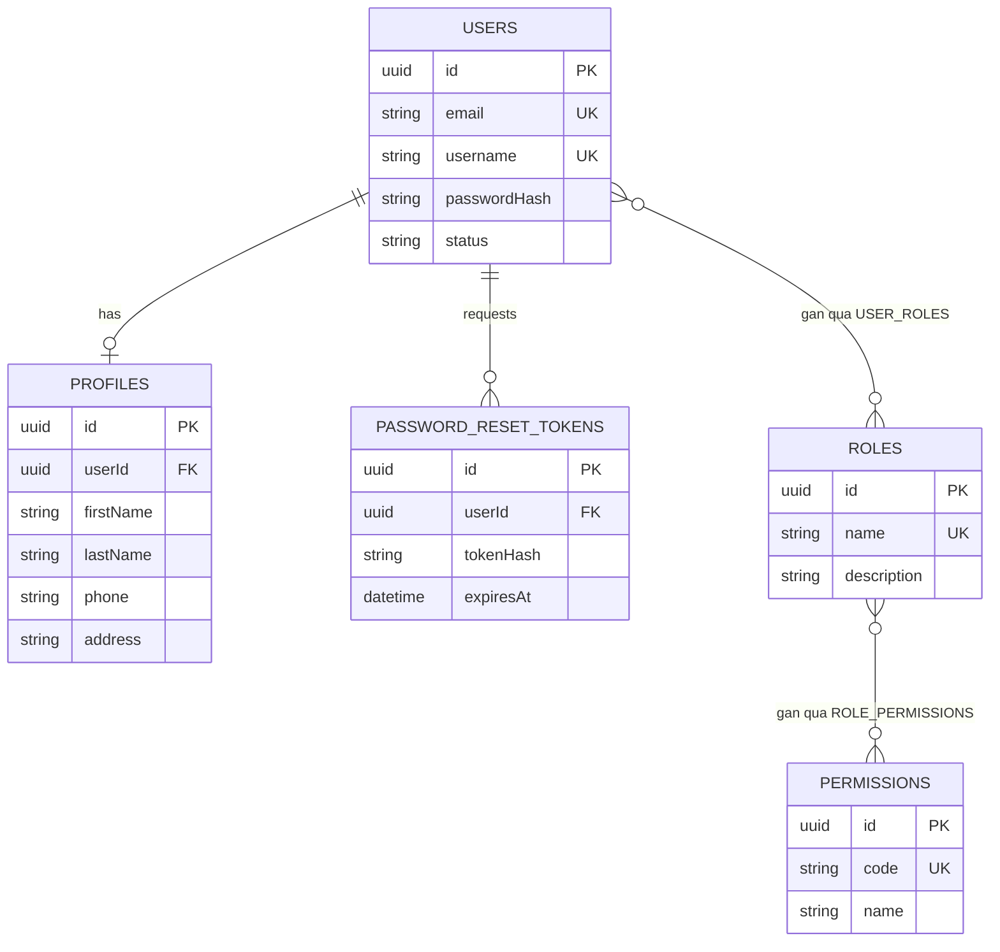

## Sơ đồ 7 — ERD Product Service

Không đổi so với đợt 1 — cấu trúc dữ liệu Product Service chưa thay đổi. **Dùng lại đúng ảnh này ở
cả 2 vị trí trong Word: mục 2.5.2 và mục 3.4.2.**

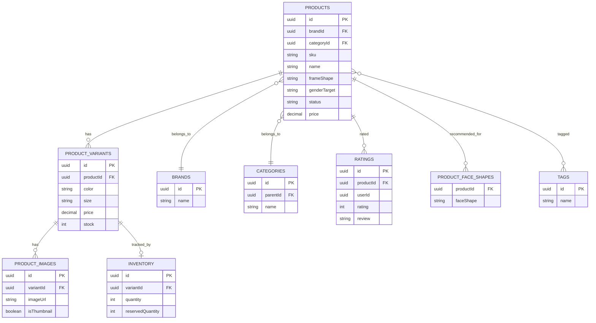

## Sơ đồ 8 — ERD Face Processing Service (mới, đợt 2)

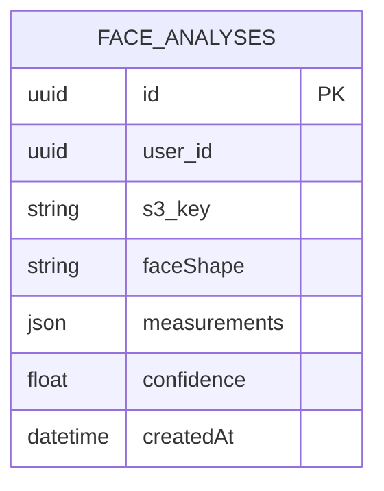

## Sơ đồ 9 — ERD Order Service (mới, đợt 2)

Giỏ hàng không có bảng riêng — lưu trực tiếp trong Redis, không thuộc `order_db`.

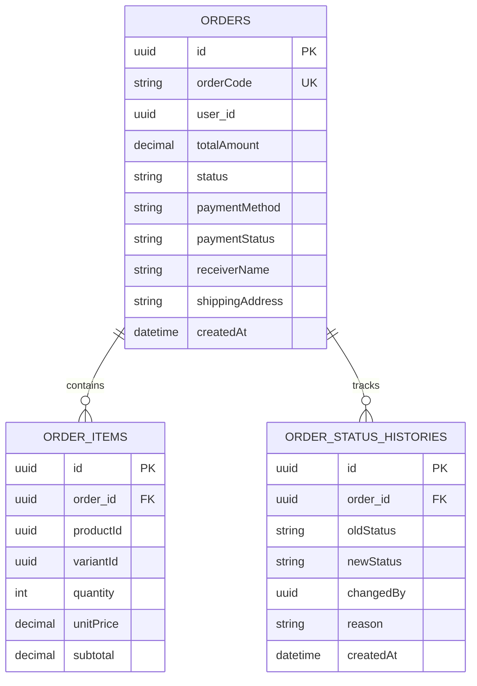

## Sơ đồ 10 — Luồng xử lý end-to-end (sequence diagram)

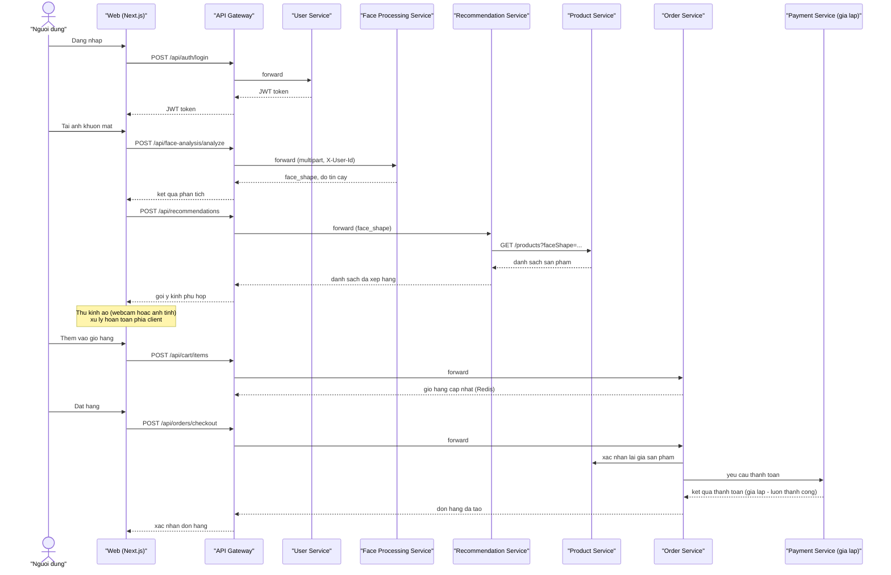

## Sơ đồ 11 — Vòng đời trạng thái đơn hàng

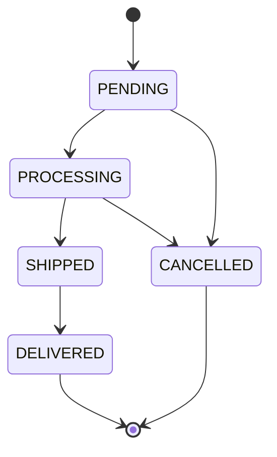

## Sơ đồ 12 — Biểu đồ tiến độ (Gantt)

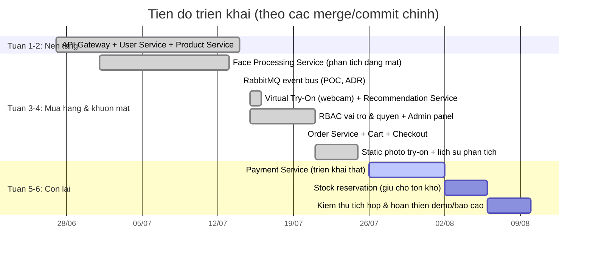
