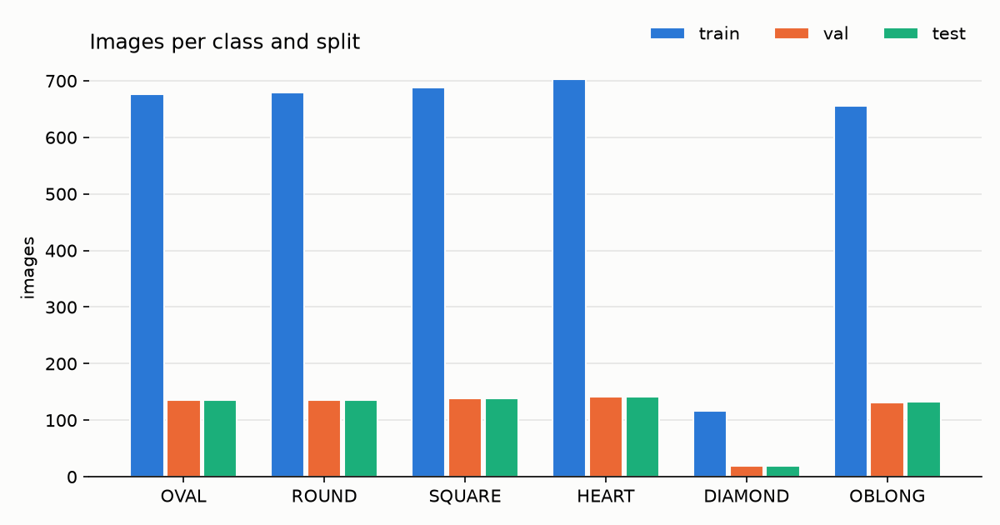

# Face-shape dataset card

Generated 2026-09-30 from `data` by `make card`. Numbers come from the pipeline outputs; do not edit by hand.

## Final dataset (after dedup, face filters and identity-aware split)

| class | train | val | test | total |
|---|---|---|---|---|
| OVAL | 677 | 136 | 135 | 948 |
| ROUND | 680 | 136 | 136 | 952 |
| SQUARE | 688 | 138 | 138 | 964 |
| HEART | 703 | 141 | 141 | 985 |
| DIAMOND | 117 | 19 | 19 | 155 |
| OBLONG | 656 | 131 | 132 | 919 |
| TOTAL | 3521 | 701 | 701 | 4923 |

- Imbalance ratio (largest / smallest non-empty class): **6.35**.
- **DIAMOND: 155 images, below the 200 minimum (shortfall 45).**
- Persons per split: train 457, val 91, test 94; 0 persons appear in more than one split (checked by `split.py`).

## Manifest

- 5175 images in `interim/sources.csv`.
- Removed while building the manifest: none.

## Deduplication (dHash + pHash)

- Near-duplicate threshold: Hamming <= 8 on both hashes (horizontal mirrors count as duplicates).
- Duplicate groups: 73; removed duplicates: 68; removed cross-label duplicates: 20; kept: 5087.

## Pseudo-identities

- Backend `insightface`; cosine threshold used 0.500 (configured: 0.5); suggested from the null distribution (p1 of 19998 random pairs) 0.476; 1.03% of random pairs fall below the used threshold.
- 659 persons for 5087 images; images/person mean 7.72, median 1, max 131; 485 singletons; 156 images without a face embedding (own singleton id).

## Face filter rejections (MediaPipe)

- |yaw| limit 20 deg; min cheekbone width 80 px.
- Rejected: small_face 132, yaw_exceeded 26, multi_face 6.

## Sources and licenses

| source | license | source_url | images |
|---|---|---|---|
| kaggle/lucifierx | not stated - research use only | https://www.kaggle.com/datasets/lucifierx/face-shape-classification | 12 |
| kaggle/minhquangbui | not stated - research use only | https://www.kaggle.com/datasets/minhquangbui/face-shapes | 63 |
| niten19 | unclear (scraped celebrity images) - research use only | https://www.kaggle.com/datasets/niten19/face-shape-dataset | 5000 |
| roboflow/face-shape-real | CC BY 4.0 | https://universe.roboflow.com/face-detection-beautysense/face-shape-real-lagcm | 100 |

- niten19 (Kaggle): license unclear (scraped celebrity images) -> **research use only**; the original train/test split was discarded and re-split by identity.
- Extra Kaggle DIAMOND sources (minhquangbui, lucifierx): no license stated -> **research use only**.
- Roboflow Universe exports are CC BY 4.0 -> attribution required. Per-image source URL and license are in `interim/sources.csv`. Attribution list:
  - face-detection-beautysense/face-shape-real-lagcm v4 - https://universe.roboflow.com/face-detection-beautysense/face-shape-real-lagcm (CC BY 4.0)

## Limitations

- Gender bias: niten19 contains only female celebrities; the DIAMOND images from Roboflow/Kaggle extras may include men (Q2).
- Label noise: niten19 labels come from web sources ("celebrity X has a Y face"); expect Oval/Oblong and Round/Oval confusions.
- Person ids are pseudo-identities from face-embedding clustering, not ground truth.
- InsightFace `buffalo_l` weights are licensed for non-commercial research only.
- Landmark 10 is the top of the face mesh, not the hairline, so `lw_ratio` underestimates face length (`lw_ratio_ext` extrapolates it).
